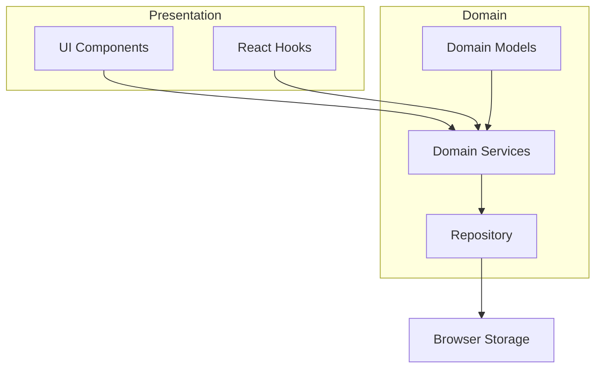

# System Patterns

## Architecture Overview

Sprose follows a domain-driven design approach with a clear separation of concerns. The application is structured around the core domain concept of hierarchical items (cards) that can be created, edited, moved, and organized.



## Key Design Patterns

### Domain-Driven Design

The project follows a domain-driven design approach with a clear development workflow:

1. **Domain Models**: Core entities like `Item` are defined with clear types and validation schemas.
2. **Factories**: Functions like `createNewItem` encapsulate the creation of domain objects.
3. **Repositories**: The `MapRepository` handles persistence operations.
4. **Services**: Pure functions that implement domain logic without side effects.

### Immutability Pattern

All operations on domain objects follow an immutability pattern:

- Services never mutate domain object instances passed as arguments
- Instead, they create and return new instances with the desired changes
- This ensures predictable state management and easier debugging

Example from `services/index.ts`:

```typescript
export function updateItem(items: Item, newItem: { id: string } & Partial<Item>): Item {
  if (items.id === newItem.id) {
    return { ...items, ...newItem };
  }
  return {
    ...items,
    children: items.children.map((child) => updateItem(child, newItem)),
  };
}
```

### Recursive Tree Operations

Since the core data structure is a tree of items, many operations use recursive functions to traverse and manipulate the tree:

- `updateItem`: Recursively updates an item in the tree
- `addNewItem`: Recursively adds a new item to a specific parent
- `deleteItem`: Recursively removes an item from the tree
- `findChildById`: Recursively searches for an item by ID
- `findParentByChildId`: Recursively finds a parent of an item

### Repository Pattern

The `MapRepository` class encapsulates all storage operations:

- `get()`: Retrieves the current map from storage
- `save(map)`: Saves a map to storage, managing history
- `undo()`: Moves back in history
- `redo()`: Moves forward in history
- `delete()`: Removes the map from storage

### Factory Pattern

Factory functions are used to create domain objects:

- `createEmptyMap()`: Creates an empty root map
- `createNewItem(description, id?)`: Creates a new item with the given description

### Command Pattern (Implicit)

While not explicitly named as such, the application uses a command-like pattern for operations:

- Each operation (update, delete, move) is encapsulated in a function
- Operations are submitted to the server via fetchers
- History is maintained for undo/redo functionality

## Component Structure

The UI follows a component-based architecture with clear responsibilities:

- **Page**: The main container that renders the overall layout.
- **ItemFamily**: Renders an item and its children. Handles expansion/collapse and context menus.
    - When collapsed, renders only the item card vertically.
    - When expanded, renders the item card on the left and arranges child groups horizontally.
    - Uses `groupChildren` utility to group consecutive non-parent children.
    - Renders child groups using either `ItemFamily` (for children with their own children) or `ChildrenBox`.
- **ItemCard**: Renders an individual item, handling editing and context menus. Includes logic for seamless sequential card addition.
- **ChildrenBox**: Renders a vertical grid of non-parent child items within an expanded `ItemFamily`.
- **AddItemButton**: _(This component seems to have been removed or its functionality integrated elsewhere, likely into `ItemCard`'s editing logic based on `addingItemId` context)_.

## State Management

The application uses React Router's data APIs for state management:

- `clientLoader`: Loads the initial state from storage
- `clientAction`: Handles state mutations (update, delete)
- `useFetcher`: Hook for triggering actions and accessing updated data

## Drag and Drop Implementation

Custom drag and drop functionality is implemented using:

- Native HTML5 drag and drop API
- Custom hooks (`useStartCardInsert`, `useAcceptCardInsert`)
- Different drop acceptors based on expansion state:
    - `VerticalDropAcceptor` when collapsed.
    - `HorizontalDropAcceptor` when expanded (accepts drops between horizontally arranged child groups).
- Visual indicators for drop targets.

## Clipboard Integration

The application integrates with the system clipboard:

- `copyItemToClipboard`: Serializes items to Markdown and copies to clipboard
- `getChildFromClipboard`: Parses Markdown from clipboard into items

## Markdown Serialization

Items can be serialized to and from Markdown:

- `parseMarkdownToItem`: Converts Markdown lists to item trees
- `serializeItemToMarkdown`: Converts item trees to Markdown lists

## Key Technical Decisions

1. **Browser Storage**: Using LocalForage for persistent storage in the browser
2. **History Management**: Implementing undo/redo with a history stack
3. **Immutable Updates**: Using immutable patterns for all state updates
4. **Recursive Tree Operations**: Implementing tree operations recursively
5. **Zod Validation**: Using Zod for runtime type validation
6. **CSS Modules**: Using CSS modules for component-specific styling
7. **Tailwind CSS**: Using Tailwind for utility-based styling
8. **React Router Data APIs**: Using React Router's data APIs for state management
